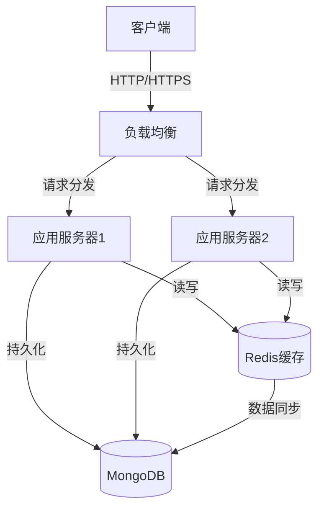
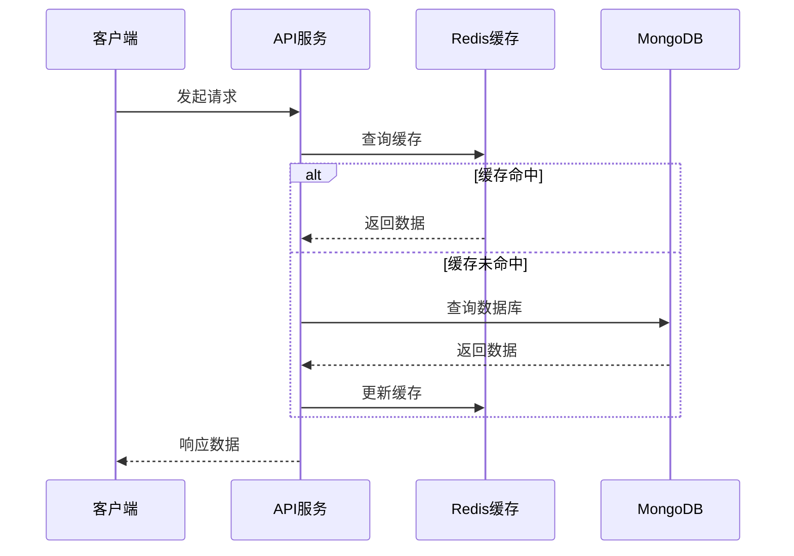
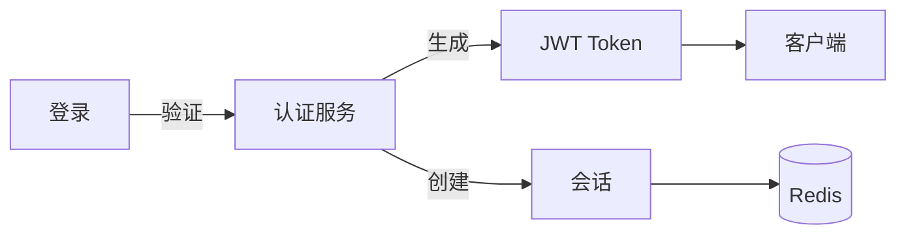
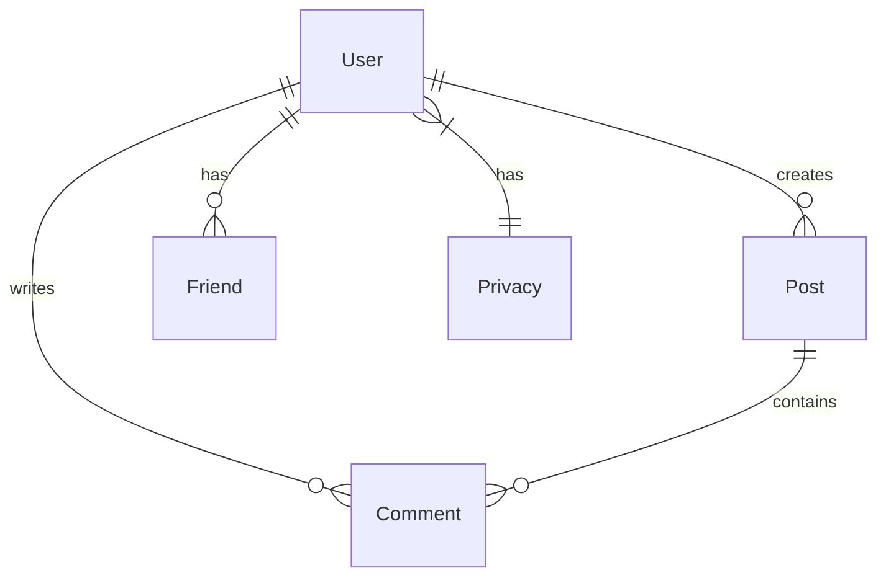
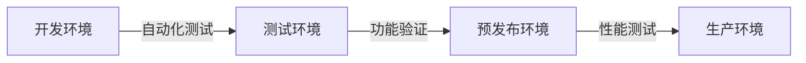

# 项目架构文档

## 1. 技术栈概览

### 1.1 前端技术栈
```
- React 18
- React Router v6
- Styled Components
- Ant Design
- Axios
```

### 1.2 后端技术栈
```
- Node.js
- Express.js
- MongoDB (数据库)
- Redis (缓存)
- JWT (认证)
```

## 2. 系统架构图

### 2.1 整体架构


### 2.2 数据流图


## 3. 目录结构

### 3.1 前端目录结构
```
client/
├── public/
├── src/
│   ├── components/          # React组件
│   │   ├── Auth/           # 认证相关组件
│   │   ├── Layout/         # 布局组件
│   │   ├── Profile/        # 个人资料组件
│   │   └── Admin/          # 管理员组件
│   ├── hooks/              # 自定义Hooks
│   ├── services/           # API服务
│   ├── utils/              # 工具函数
│   ├── styles/             # 全局样式
│   ├── context/            # React Context
│   ├── App.js             # 根组件
│   └── index.js           # 入口文件
```

### 3.2 后端目录结构
```
server/
├── config/                 # 配置文件
├── controllers/           # 业务逻辑控制器
├── middleware/           # 中间件
├── models/              # 数据模型
├── routes/              # 路由定义
├── utils/              # 工具函数
├── uploads/            # 文件上传目录
├── docs/              # 文档
└── server.js          # 入口文件
```

## 4. 核心模块说明

### 4.1 认证模块


### 4.2 缓存策略
```javascript
// 缓存层次
1. 内存缓存 (Redis)
   - 会话信息
   - 用户基本信息
   - 热门内容

2. 数据库 (MongoDB)
   - 持久化数据
   - 完整用户信息
   - 历史数据
```

### 4.3 数据模型关系


## 5. 安全架构

### 5.1 认证流程
```javascript
1. JWT认证
   - Token生成与验证
   - 过期时间控制
   - 刷新机制

2. 会话管理
   - Redis存储
   - 多设备支持
   - 会话超时

3. 权限控制
   - 角色基础访问控制
   - 资源级权限
   - 操作审计
```

### 5.2 数据安全
```javascript
1. 数据加密
   - 密码哈希(bcrypt)
   - 敏感信息加密
   - HTTPS传输

2. 访问控制
   - 中间件验证
   - 角色权限
   - API限流
```

## 6. 性能优化

### 6.1 缓存优化
```javascript
1. 多级缓存
   - Redis缓存
   - 内存缓存
   - 客户端缓存

2. 缓存策略
   - LRU淘汰
   - 过期时间
   - 预加载
```

### 6.2 数据库优化
```javascript
1. 索引优化
   - 复合索引
   - 文本索引
   - 地理位置索引

2. 查询优化
   - 延迟加载
   - 字段投影
   - 批量操作
```

## 7. 监控告警

### 7.1 系统监控
```javascript
1. 性能指标
   - API响应时间
   - 缓存命中率
   - 系统资源使用

2. 业务指标
   - 用户活跃度
   - 操作转化率
   - 错误率统计
```

### 7.2 告警机制
```javascript
1. 监控指标
   - 系统负载
   - 错误率
   - 响应时间
   - 磁盘使用

2. 告警级别
   - 严重告警
   - 警告信息
   - 提示信息
```

## 8. 部署架构

### 8.1 开发环境
```javascript
- 本地开发环境
- 测试环境
- 预发布环境
- 生产环境
```

### 8.2 部署流程


## 9. 扩展性设计

### 9.1 水平扩展
```javascript
1. 应用层
   - 多实例部署
   - 负载均衡
   - 会话共享

2. 数据层
   - 读写分离
   - 分片集群
   - 数据备份
```

### 9.2 垂直扩展
```javascript
1. 功能模块化
   - 核心服务
   - 业务服务
   - 辅助服务

2. 服务解耦
   - 消息队列
   - 事件驱动
   - 微服务架构
```