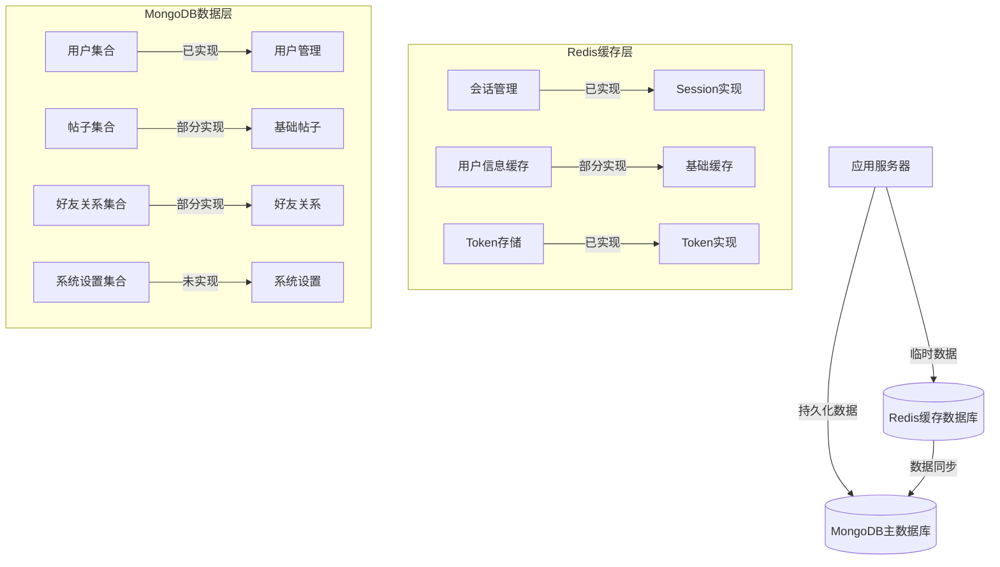

# 数据库系统文档

## 1. 数据库架构

### 1.1 整体架构 ✅


## 2. MongoDB 数据模型

### 2.1 用户集合 (Users) ✅
```javascript
// 集合名: users
// 状态: 已完全实现
{
  _id: ObjectId,
  username: String,
  email: String,
  password: String,  // bcrypt加密
  avatar: String,    // 头像路径
  role: String,      // 用户角色: "user" | "admin"
  bio: String,       // 个人简介
  website: String,   // 个人网站
  privacy: {
    profileVisibility: String,    // "public" | "private"
    showEmail: Boolean,
    showFollowers: Boolean,
    showFollowing: Boolean,
    showPosts: Boolean
  },
  createdAt: Date,
  updatedAt: Date
}
```

### 2.2 帖子集合 (Posts) ⚠️
```javascript
// 集合名: posts
// 状态: 部分实现
{
  _id: ObjectId,
  userId: ObjectId,    // 关联用户ID
  content: String,     // 帖子内容
  images: [String],    // 图片路径数组 - 待实现
  likes: [ObjectId],   // 点赞用户ID数组 - 待实现
  comments: [{         // 待实现
    userId: ObjectId,
    content: String,
    createdAt: Date
  }],
  visibility: String,  // "public" | "friends" | "private"
  createdAt: Date,
  updatedAt: Date
}
```

### 2.3 好友关系集合 (Friends) ⚠️
```javascript
// 集合名: friends
// 状态: 部分实现
{
  _id: ObjectId,
  userId: ObjectId,      // 用户ID
  friendId: ObjectId,    // 好友ID
  status: String,        // "pending" | "accepted" | "blocked"
  createdAt: Date,
  updatedAt: Date
}
```

### 2.4 系统设置集合 (Settings) ❌
```javascript
// 集合名: settings
// 状态: 未实现
{
  _id: ObjectId,
  key: String,         // 设置键名
  value: Mixed,        // 设置值
  description: String, // 设置描述
  updatedAt: Date
}
```

## 3. Redis 数据结构

### 3.1 会话存储 ✅
```javascript
// 键格式: session:{userId}:{sessionId}
// 状态: 已完全实现
{
  userId: String,
  deviceInfo: {
    userAgent: String,
    platform: String,
    language: String
  },
  loginTime: String,
  lastActive: String
}
// 过期时间: 24小时
```

### 3.2 用户信息缓存 ⚠️
```javascript
// 键格式: user:{userId}
// 状态: 部分实现
{
  _id: String,
  username: String,
  email: String,
  avatar: String,
  role: String
}
// 过期时间: 1小时
```

### 3.3 Token存储 ✅
```javascript
// 键格式: token:{userId}:{deviceId}
// 状态: 已完全实现
{
  token: String,
  createdAt: String,
  expiresAt: String
}
// 过期时间: 与token有效期一致
```

## 4. 数据库操作示例

### 4.1 MongoDB操作
```javascript
// 用户查询
const user = await User.findOne({ email });

// 创建新帖子
const post = await Post.create({
  userId,
  content,
  visibility: 'public'
});

// 更新好友状态
await Friend.findOneAndUpdate(
  { userId, friendId },
  { status: 'accepted' },
  { new: true }
);
```

### 4.2 Redis操作
```javascript
// 设置会话
await redisClient.hmset(
  `session:${userId}:${sessionId}`,
  sessionData
);

// 获取用户缓存
const userCache = await redisClient.hgetall(
  `user:${userId}`
);

// 设置token
await redisClient.set(
  `token:${userId}:${deviceId}`,
  token,
  'EX',
  86400
);
```

## 5. 数据同步机制

### 5.1 MongoDB到Redis同步
```javascript
// 用户信息更新时同步到Redis
async function syncUserToRedis(userId) {
  const user = await User.findById(userId);
  await redisClient.hmset(`user:${userId}`, {
    _id: user._id.toString(),
    username: user.username,
    email: user.email,
    avatar: user.avatar,
    role: user.role
  });
}
```

### 5.2 数据一致性保证
```javascript
// 更新用户信息
async function updateUserInfo(userId, updateData) {
  // 1. 更新MongoDB
  const user = await User.findByIdAndUpdate(
    userId,
    updateData,
    { new: true }
  );
  
  // 2. 更新Redis缓存
  await syncUserToRedis(userId);
  
  // 3. 清理相关缓存
  await redisClient.del(`userPosts:${userId}`);
  
  return user;
}
```

## 6. 索引设计

### 6.1 MongoDB索引
```javascript
// users集合索引
{
  email: 1,        // 唯一索引
  username: 1,     // 普通索引
  role: 1          // 普通索引
}

// posts集合索引
{
  userId: 1,       // 普通索引
  createdAt: -1    // 普通索引
}

// friends集合索引
{
  userId: 1,       // 复合索引
  friendId: 1      // 复合索引
}
```

### 6.2 Redis索引
```javascript
// 用户会话索引
session:*          // 会话键模式
user:*             // 用户缓存键模式
token:*            // Token键模式
```

## 7. 性能优化

### 7.1 MongoDB优化
1. 索引优化
   - 创建合适的索引
   - 避免过多索引
   - 定期检查索引使用情况

2. 查询优化
   - 使用投影限制返回字段
   - 合理使用分页
   - 避免大规模操作

### 7.2 Redis优化
1. 内存优化
   - 合理设置过期时间
   - 及时清理无用数据
   - 监控内存使用情况

2. 性能优化
   - 使用管道操作
   - 批量操作
   - 避免大key

## 8. 备份策略

### 8.1 MongoDB备份
```bash
# 每日全量备份
mongodump --db social_network --out /backup/mongodb/$(date +%Y%m%d)

# 增量备份 (oplog)
mongodump --db social_network --oplog --out /backup/mongodb/oplog
```

### 8.2 Redis备份
```bash
# RDB备份
save 900 1    # 900秒内有1个修改
save 300 10   # 300秒内有10个修改
save 60 10000 # 60秒内有10000个修改

# AOF备份
appendonly yes
appendfsync everysec
```

## 9. 监控指标

### 9.1 MongoDB监控
- 连接数
- 查询性能
- 内存使用
- 索引使用情况
- 慢查询日志

### 9.2 Redis监控
- 内存使用率
- 命中率
- 连接数
- 操作延迟
- 过期键数量

## 10. 安全措施

### 10.1 访问控制
```javascript
// MongoDB访问控制
mongoose.connect(MONGODB_URI, {
  user: process.env.MONGODB_USER,
  pass: process.env.MONGODB_PASS,
  authSource: 'admin'
});

// Redis访问控制
const redis = new Redis({
  password: process.env.REDIS_PASSWORD,
  tls: process.env.NODE_ENV === 'production'
});
```

### 10.2 数据安全
1. 敏感数据加密
2. 定期备份
3. 访问日志记录
4. 防火墙配置

## 11. 开发规范

### 11.1 命名规范
```javascript
// MongoDB集合命名
users            // 用户集合
posts            // 帖子集合
friends          // 好友关系集合
settings         // 系统设置集合

// Redis键命名
session:{userId}:{sessionId}  // 会话键
user:{userId}                 // 用户缓存键
token:{userId}:{deviceId}     // Token键
```

### 11.2 操作规范
1. 使用事务确保数据一致性
2. 正确处理异常情况
3. 遵循最小权限原则
4. 及时清理过期数据

## 12. 注意事项

1. 数据库连接
   - 使用连接池
   - 处理断开重连
   - 监控连接状态

2. 数据一致性
   - 合理使用事务
   - 同步策略选择
   - 并发控��

3. 性能问题
   - 避免大规模查询
   - 合理使用索引
   - 定期优化维护

## 13. 开发计划

### 13.1 近期计划
1. 完善帖子系统
   ```javascript
   // 优先级：高
   // 计划完成时间：2周内
   - 实现图片上传功能
   - 实现评论系统
   - 实现点赞功能
   ```

2. 优化缓存系统
   ```javascript
   // 优先级：中
   // 计划完成时间：1个月内
   - 实现完整的用户信息缓存
   - 添加帖子缓存
   - 优化缓存更新策略
   ```

3. 实现系统设置功能
   ```javascript
   // 优先级：低
   // 计划完成时间：2个月内
   - 创建系统设置集合
   - 实现配置管理
   - 添加管理界面
   ```

### 13.2 已知问题
1. 数据同步
   - Redis和MongoDB之间的数据同步需要优化
   - 缓存更新策略需要完善
   - 并发处理需要加强

2. 性能优化
   - 需要添加更多的索引
   - 缓存预热机制待实现
   - 大规模数据处理待优化

3. 监控告警
   - 需要实现完整的监控系统
   - 添加性能指标采集
   - 实现告警机制

### 1.4 Neo4j 图数据库设计 ✅
```javascript
// 节点类型
(:User {
    userId: String,
    username: String,
    createdAt: DateTime
})

// 关系类型
[:FRIEND {
    since: DateTime,
    strength: Number,  // 关系强度
    lastInteraction: DateTime
}]

// 主要查询模式
MATCH (u:User)-[r:FRIEND*1..3]-(f:User)
WHERE u.userId = $userId
RETURN f, length(r) as distance, count(*) as count

// 社交圈子查询
MATCH (u:User)-[r:FRIEND]-(f:User)
WHERE u.userId = $userId
WITH f, r.strength as strength
RETURN CASE 
    WHEN strength > 0.7 THEN 'close'
    ELSE 'distant'
END as type, collect(f) as members
```