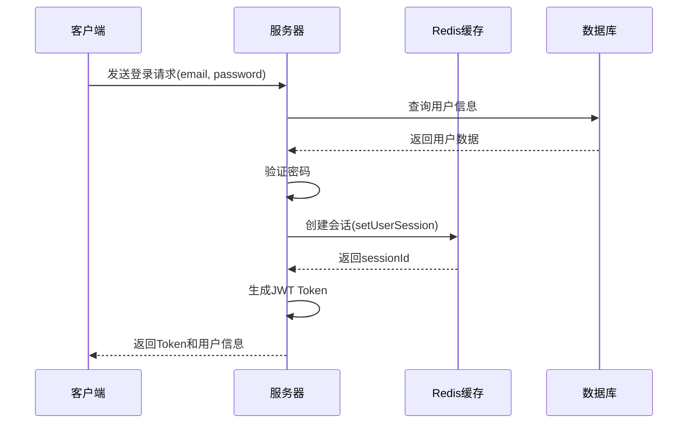
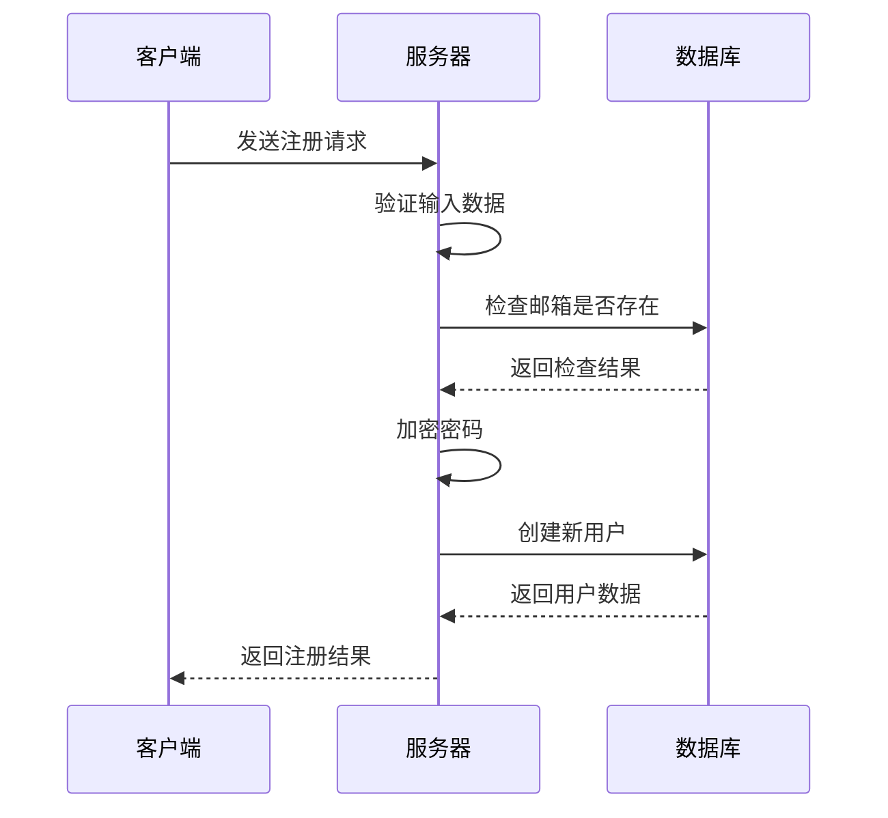
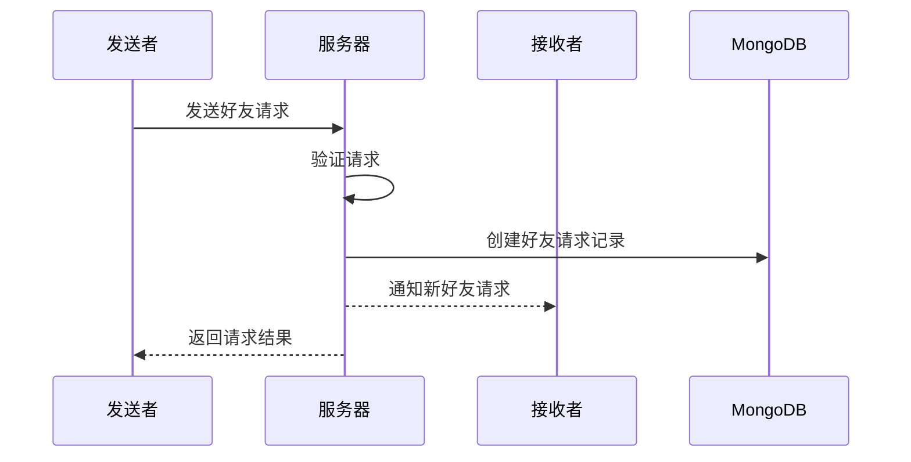

# 系统功能逻辑文档

## 1. 用户认证系统 ✅

### 1.1 登录流程


### 1.2 会话管理
```javascript
// 会话创建逻辑
async setUserSession(userId, sessionData) {
    // 生成唯一会话ID
    const sessionId = `${userId}_${Date.now()}_${Math.random().toString(36).substr(2, 9)}`;
    const key = `session:${userId}:${sessionId}`;
    
    // 获取用户现有会话
    const existingSessions = await this.getUserActiveSessions(userId);
    
    // 处理同设备登录
    for (const session of existingSessions) {
        if (session.deviceInfo?.userAgent === sessionData.deviceInfo?.userAgent) {
            await this.removeSession(userId, session.sessionId);
        }
    }
    
    // 设置新会话
    await this.client.hmset(key, {
        ...sessionData,
        lastActive: Date.now()
    });
    
    return sessionId;
}
```

### 1.3 权限验证
```javascript
// 权限中间件
const authMiddleware = async (req, res, next) => {
    try {
        const token = req.header('Authorization');
        const sessionId = req.header('Session-ID');
        
        if (!token || !sessionId) {
            return res.status(401).json({ message: '无访问权限' });
        }

        // 验证JWT
        const decoded = jwt.verify(token, process.env.JWT_SECRET);
        
        // 验证会话
        const session = await RedisClient.validateSession(decoded.userId, sessionId);
        if (!session) {
            return res.status(401).json({ message: '会话已过期' });
        }
        
        req.user = decoded;
        next();
    } catch (error) {
        res.status(401).json({ message: '认证失败' });
    }
};
```

## 2. 用户管理系统 ✅

### 2.1 注册流程


### 2.2 用户信息管理
```javascript
// 用户信息更新逻辑
async function updateUserProfile(userId, updateData) {
    // 验证更新数据
    const validatedData = await validateUpdateData(updateData);
    
    // 更新数据库
    const updatedUser = await User.findByIdAndUpdate(
        userId,
        { $set: validatedData },
        { new: true }
    );
    
    // 更新缓存
    await RedisClient.setUserCache(userId, updatedUser);
    
    return updatedUser;
}
```

## 3. 好友系统 ⚠️

### 3.1 好友请求流程


### 3.2 好友关系管理
```javascript
// 好友关系处理逻辑
async function handleFriendRequest(userId, friendId, action) {
    const friendRequest = await Friend.findOne({
        userId: friendId,
        friendId: userId,
        status: 'pending'
    });

    if (!friendRequest) {
        throw new Error('好友请求不存在');
    }

    if (action === 'accept') {
        await Friend.findByIdAndUpdate(
            friendRequest._id,
            { status: 'accepted' }
        );
    } else if (action === 'reject') {
        await Friend.findByIdAndDelete(friendRequest._id);
    }
}
```

## 3.3 社交分析系统 ✅

### 3.3.1 社交圈子分析
```javascript
// 社交圈子分析逻辑
async function analyzeSocialCircles(userId) {
    const circles = await neo4jService.getSocialCircles(userId);
    return {
        close: circles.filter(c => c.type === 'close'),
        distant: circles.filter(c => c.type === 'distant')
    };
}
```

### 3.3.2 影响力分析
```javascript
// 社交影响力分析逻辑
async function analyzeSocialInfluence(userId) {
    const influence = await neo4jService.getSocialInfluence(userId);
    return {
        totalReach: influence.totalReach,
        distribution: influence.distribution
    };
}
```

## 4. 管理员系统 ✅

### 4.1 权限控制
```javascript
// 管理员权限中间件
const adminMiddleware = async (req, res, next) => {
    try {
        const user = req.user;
        if (user.role !== 'admin') {
            return res.status(403).json({ 
                message: '需要管理员权限' 
            });
        }
        next();
    } catch (error) {
        res.status(403).json({ message: '权限验证失败' });
    }
};
```

### 4.2 缓存监控
```javascript
// 缓存监控逻辑
async function getCacheMetrics() {
    const metrics = {
        memoryUsage: await RedisClient.getMemoryUsage(),
        keyCount: await RedisClient.getKeyCount(),
        hitRate: await RedisClient.getHitRate()
    };

    // 记录历史数据
    await MetricsHistory.create({
        type: 'cache',
        metrics,
        timestamp: new Date()
    });

    return metrics;
}
```

## 5. 数据同步机制 ⚠️

### 5.1 缓存更新策略
```javascript
// 缓存更新逻辑
async function updateCache(type, id, data) {
    switch(type) {
        case 'user':
            await RedisClient.setUserCache(id, data);
            break;
        case 'session':
            await RedisClient.updateSession(id, data);
            break;
        // 其他类型待实现
    }
}
```

### 5.2 数据一致性维护
```javascript
// 数据一致性检查
async function validateDataConsistency(userId) {
    const cachedUser = await RedisClient.getUserCache(userId);
    const dbUser = await User.findById(userId);
    
    if (!_.isEqual(cachedUser, dbUser)) {
        await RedisClient.setUserCache(userId, dbUser);
        logInconsistency('user', userId);
    }
}
```

## 6. 错误处理机制 ✅

### 6.1 全局错误处理
```javascript
// 全局错误处理中间件
app.use((error, req, res, next) => {
    console.error('错误:', error);
    
    // 区分错误类型
    if (error.name === 'ValidationError') {
        return res.status(400).json({
            message: '数据验证失败',
            details: error.details
        });
    }
    
    if (error.name === 'UnauthorizedError') {
        return res.status(401).json({
            message: '未授权访问'
        });
    }
    
    // 默认服务器错误
    res.status(500).json({
        message: '服务器内部错误'
    });
});
```

### 6.2 业务错误处理
```javascript
// 业务错误类
class BusinessError extends Error {
    constructor(message, code) {
        super(message);
        this.name = 'BusinessError';
        this.code = code;
    }
}

// 使用示例
async function addFriend(userId, friendId) {
    if (userId === friendId) {
        throw new BusinessError('不能添加自己为好友', 'INVALID_FRIEND');
    }
    // ... 其他逻辑
}
```

## 7. 系统状态 

### 7.1 已实现功能 ✅
- 用户认证系统
- 会话管理
- 基础权限控制
- 用户信息管理
- 管理员功能
- 全局错误处理

### 7.2 部分实现功能 ⚠️
- 好友系统
- 数据同步机制
- 缓存策略

### 7.3 待实现功能 ❌
- 消息通知系统
- 高级权限管理
- 完整的监控系统
- 数据分析功能

## 8. 注意事项

### 8.1 安全性
1. 所有密码必须加密存储
2. 敏感操作需要二次验证
3. 定期清理过期会话
4. 监控异常登录行为

### 8.2 性能
1. 合理使用缓存
2. 避免重复查询
3. 使用批量操作
4. 定期优化数据库

### 8.3 可维护性
1. 遵循代码规范
2. 完善错误处理
3. 添加详细日志
4. 模块化设计